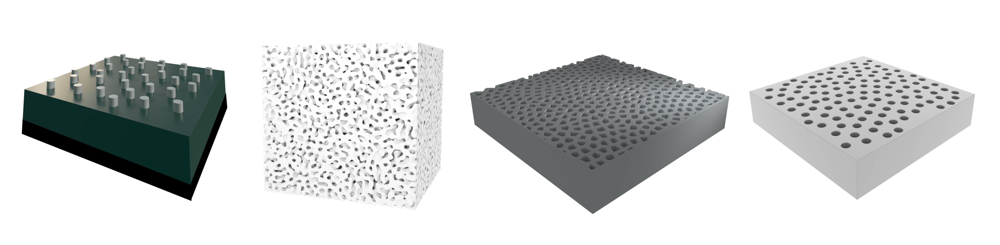

# TOolkit for Spatially TAilored Disordered Arrangement (TOSTADA)

_TOolkit for Spatially TAilored Disordered Arrangement (TOSTADA)_ is a GPU-enabled python package for **creating**, **simulating** and **analyzing** spatially disordered distributions with prescribed correlations in 2D/3D.
The key idea behind `tostada` is to translate inverse-design and statistics tools specifically used in the context of disordered media to open-source physics-based solvers for simulating their optical or mechanical response.
This repository brings together multiple computational strategies to explore the physics and geometry of complex disordered systems. Whether it is simulating wave propagation through disordered lattices, characterizing porous microstructure statistics, or using optimization tools to generate materials with tailored correlation functions — this toolkit has you covered.

## 🔧 Features

### :computer: Generation (Inverse Design)
Generate disordered phase or point distributions with **prescribed spatial statistics** using:
  - Reciprocal-space optimization 
  - Gaussian random fields
  - Custom loss functions targeting structure factor, real-space correlation functions, energy minimization strategies.

### :atom_symbol: Physics simulation 

- **MEEP Plugins**: Export and simulate wave dynamics in disordered media using MIT's Finite-Difference Time-Domain (FDTD) Maxwell solver, _[MEEP](https://meep.readthedocs.io/)_ with custom plugins for particle-type distributions (for example, distribution of nanodisks) or phase-type distributions (for example, porous microstructures).
- **Lattice Particle Method**: GPU-enabled in-house solver to model mechanical response and fracture mechanics in two-phase media for linear regime.

### :bar_chart: Analysis
- **Spatial Statistics Tools**: 
  - Pair correlation functions
  - Structure factors 
  - Angular averages
  - Hyperuniformity index

## Installation

The package and its necessary dependencies can be downloaded by typing the following command in the terminal:

`git clone https://gitlab.informatik.uni-halle.de/mikromd/tostada.git`

For convenient installation, we recommend a conda package manager. To avoid a bulky Anaconda download, it is sufficient to download Miniconda. If not already downloaded on your system, follow the instructions given [**here**](https://www.anaconda.com/docs/getting-started/miniconda/main). Then, `cd` to the directory containing the source files and type:

`conda env create -f environment_tostada.yml` 

and follow subsequent instructions. After successful installation, this will create a new conda environment `tost` visible by typing `conda env list` in the terminal. For seamless code development and research with tostada, it is advisable to now type in the terminal:

`conda-develop /home/yourname/folder/tostada/src`

Replace `/home/yourname/folder` with whichever folder containing `tostada` source files. With this, one is fully equipped to import `tostada` anywhere from the system.

For quick learning of algorithms, arguments and function implementations, it is recommended to install VS Studio with _Pylance_ and other necessary code development extensions.

The same steps provided above can be used to install and run `tostada` remotely on a server (with or without GPU). 

## 📌 Examples

Explore example notebooks and scripts in the `examples/` folder to get started with:

- Generating disordered hyperuniform media with different properties

- Computing and visualizing structure factors and pair correlations

- Export tostada geometries to MEEP for simulating wave scattering

- Extracting color information from the optical response of a disordered media

and many more...

## :books: Citation and Acknowledgements

If you use this toolkit in your research, please consider citing this repository link and in future the corresponding publication (coming soon!). 

## ☕ Contributing

Pull requests, suggestions, and issue reports are welcome! Feel free to open an issue or contact us directly.

## 📬 Contact

Feel free to reach out to the maintainer:

Prerak Dhawan
prerak.dhawan@physik.uni-halle.de
